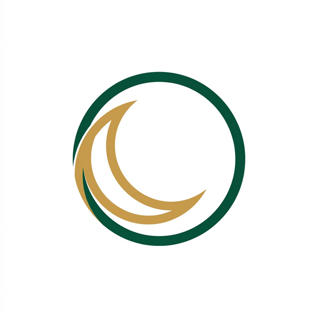
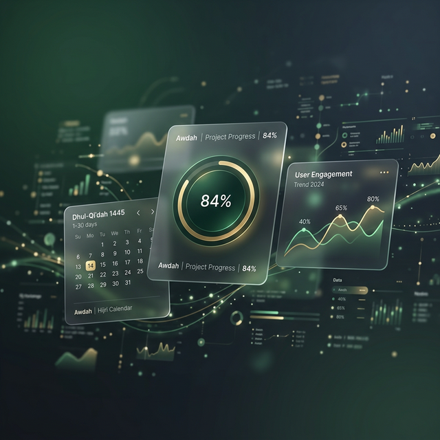

# Awdah عودة

<p align="center">
  
</p>

**An Islamic ibadah tracker for making up missed Salah and Fasts.**

**تطبيق لتتبع العبادات الفائتة من صلاة وصيام.**

<p align="center">
  
</p>

---

Awdah is a full-stack serverless web application that helps Muslims return to their missed obligatory prayers (Salah) and fasts. Built on AWS - Lambda, DynamoDB, Cognito, and CDK - with a React TypeScript frontend, Clean Architecture, Domain-Driven Design, and full Arabic RTL support. Designed to be private, compassionate, and nearly free to run.

عودة تطبيق ويب يساعدك على قضاء ما فاتك من صلوات وصيام، بهدوء ومن غير حُكم. تتبّع ما عليك، وابدأ عودتك خطوةً بخطوة.

[](https://react.dev)
[](https://www.typescriptlang.org)
[](https://aws.amazon.com)
[](https://docs.aws.amazon.com/cdk)

## Tech Stack

| Layer          | Technology                      |
| -------------- | ------------------------------- |
| Frontend       | React, TypeScript, Vite         |
| Backend        | Node.js, TypeScript, AWS Lambda |
| Infrastructure | AWS CDK (TypeScript)            |
| Database       | DynamoDB (PAY_PER_REQUEST)      |
| Auth           | AWS Cognito                     |
| CI/CD          | GitHub Actions                  |
| Local dev      | Docker Compose, LocalStack      |

## Prerequisites

- [Node.js](https://nodejs.org) (version in `.nvmrc`)
- npm
- [Docker Desktop](https://www.docker.com/products/docker-desktop) (or Docker Engine + Compose plugin)
- [AWS CLI](https://aws.amazon.com/cli/) (for occasional LocalStack inspection)

No AWS account or real credentials needed for local development.

### Local Development (Docker Compose)

1. Ensure Docker is running.
2. Run `docker compose up --build`.
3. Frontend: `http://localhost:8080`, Backend: `http://localhost:3000`.

The frontend proxies API calls to the local Lambda runner. LocalStack simulates DynamoDB, S3, SQS, SNS, EventBridge, and Secrets Manager.

### Local AWS credentials

LocalStack does not require real credentials. Copy `.env.example` to `.env.local` and use dummy values:

```bash
AWS_ACCESS_KEY_ID=test
AWS_SECRET_ACCESS_KEY=test
AWS_DEFAULT_REGION=eu-west-1
LOCALSTACK_ENDPOINT=http://localhost:4566
```

## Architecture

Clean Architecture + Domain-Driven Design with two bounded contexts: **Salah** and **Sawm**.

```
Presentation → Application → Domain ← Infrastructure
```

See [docs/architecture/](docs/architecture/) for diagrams and detailed documentation.

## Project Structure

```
awdah/
├── apps/frontend/        # React SPA (GitHub Pages)
├── apps/backend/         # AWS Lambda functions
├── infra/                # AWS CDK stacks
├── packages/shared/      # Shared types and interfaces
├── docker/               # Docker Compose + LocalStack
├── docs/architecture/    # Public architecture docs
└── .github/workflows/    # CI/CD pipelines
```

## CI/CD

| Workflow     | Trigger       | Purpose                                  |
| ------------ | ------------- | ---------------------------------------- |
| `ci.yml`     | Every PR      | ESLint, Prettier, tsc, Vitest, npm audit |
| `e2e.yml`    | Merge to main | Deploy to staging, run Playwright        |
| `deploy.yml` | Manual        | CDK deploy to staging or prod            |

## Contributing

1. Create a branch from `main` using the naming convention: `type/ticket-description`
   - Types: `feat/`, `fix/`, `chore/`, `docs/`, `refactor/`, `test/`, `infra/`
   - Example: `feat/123-new-thing`
2. Make changes and ensure pre-commit hooks pass
3. Open a PR, CI must be green before merge
4. Never commit directly to `main`

## License

Proprietary. Copyright (c) 2026 Amgad Mahmoud. All rights reserved.
See [LICENSE](LICENSE) for full terms (Non-commercial use only, collaboration and permissions).
