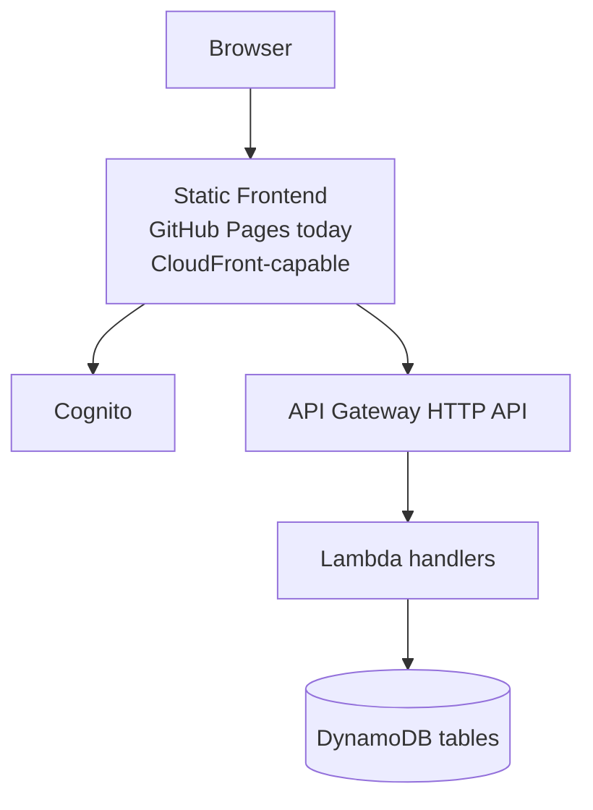

# System Context

Use this diagram when you need the fastest accurate explanation of the live system.

## ASCII

```text
                                +----------------------+
                                |      Cognito         |
                                |   JWT auth/session   |
                                +----------+-----------+
                                           ^
                                           |
+------------------+      HTTPS       +----+------------------+
|     Browser      +----------------->+   Static frontend     |
|  public + auth   |                  | GitHub Pages today    |
+---------+--------+                  | CloudFront-capable    |
          |                           +----+------------------+
          | API calls                      |
          v                                |
 +--------+------------------+             |
 |   API Gateway HTTP API    |<------------+
 |  route + JWT boundary     |
 +--------+------------------+
          |
          v
 +--------+------------------+
 |       Lambda layer        |
 |  one handler per use case |
 +--------+------------------+
          |
          v
 +--------+--------------------------------------------------+
 |                         DynamoDB                           |
 | PrayerLogs | FastLogs | PracticingPeriods | UserSettings   |
 | UserLifecycleJobs | DeletedUsers                           |
 +------------------------------------------------------------+
```

## Mermaid



## Read This As

- the browser only talks to a static frontend, Cognito, and the public API
- the frontend owns navigation and interaction flow, not business truth
- API Gateway and Lambda form the production compute boundary
- DynamoDB is the primary system of record
