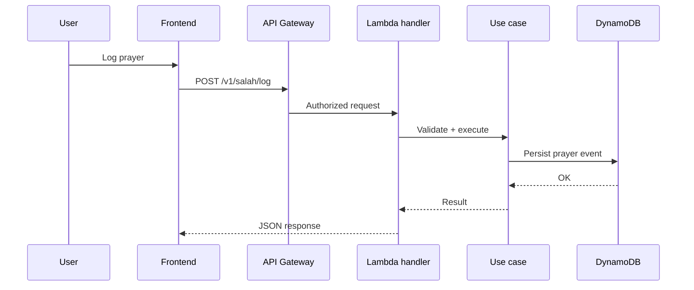

# Authenticated Request Path

this diagram is for the normal synchronous path, for example logging a prayer or fetching a debt summary.

## ASCII

```text
User action
  -> React SPA builds authenticated request
  -> API Gateway validates JWT and matches route
  -> Lambda handler parses input and resolves user context
  -> application use case runs business rules
  -> repository persists or reads data in DynamoDB
  -> JSON response returns to the SPA
```

## Mermaid



## What Matters

- handler code should stay thin
- business validation belongs in the use-case layer, where it is reusable and testable
- the frontend improves UX, but the backend remains authoritative
