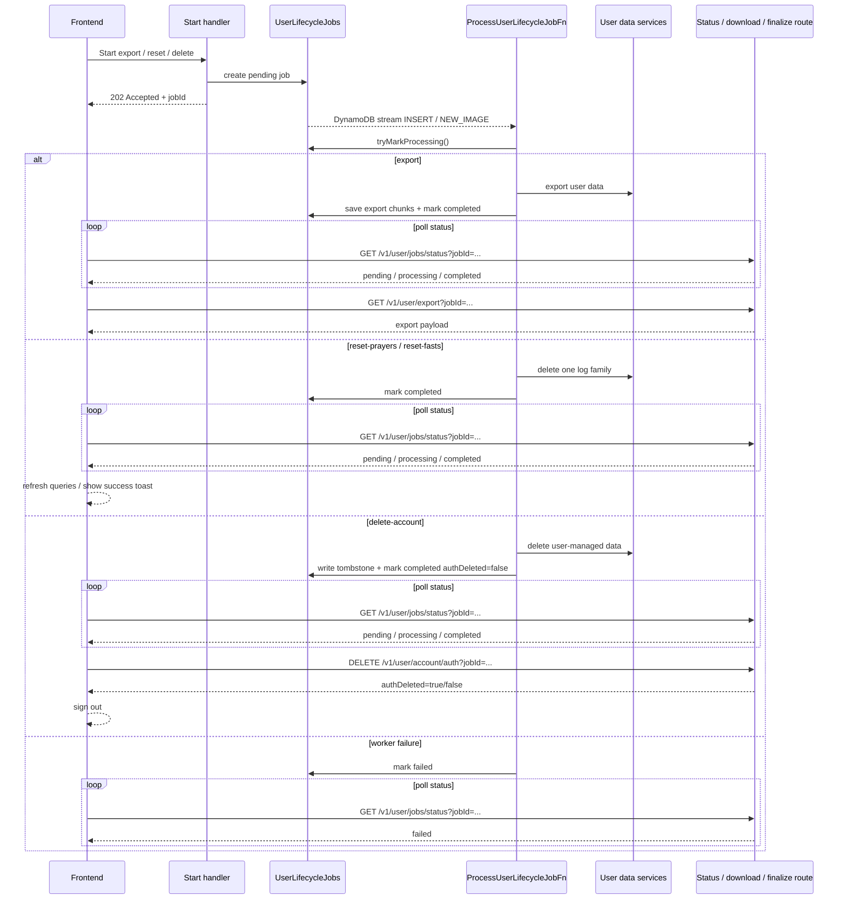

# User Lifecycle Job Flow

Use this diagram for heavy or destructive operations such as export, reset, and account deletion.

## ASCII

```text
Frontend starts delete / reset / export
  -> API handler creates pending lifecycle job in UserLifecycleJobs
  -> API returns 202 Accepted with job id
  -> DynamoDB stream on UserLifecycleJobs emits INSERT / NEW_IMAGE
  -> ProcessUserLifecycleJobFn claims the pending job
  -> worker runs one branch:
     - export: read data, store export chunks, mark completed
     - reset: delete one log family, mark completed
     - delete-account: delete app data, write DeletedUsers tombstone, mark completed with auth cleanup pending
  -> frontend polls GET /v1/user/jobs/status?jobId=...
  -> frontend performs the final user-facing step:
     - GET /v1/user/export?jobId=...
     - or DELETE /v1/user/account/auth?jobId=...
     - or just refresh/reset UI state
```

## Mermaid



## Local Dev Note

In LocalStack-style development, the repo uses an in-process dispatcher instead of waiting for the DynamoDB stream path. The state model stays the same, but the trigger mechanism is simplified for local work.

Important detail:
the DynamoDB stream triggers the worker path, not the delete-account finalization route. `DELETE /v1/user/account/auth` is a separate authenticated API call from the frontend after the delete job completes.
