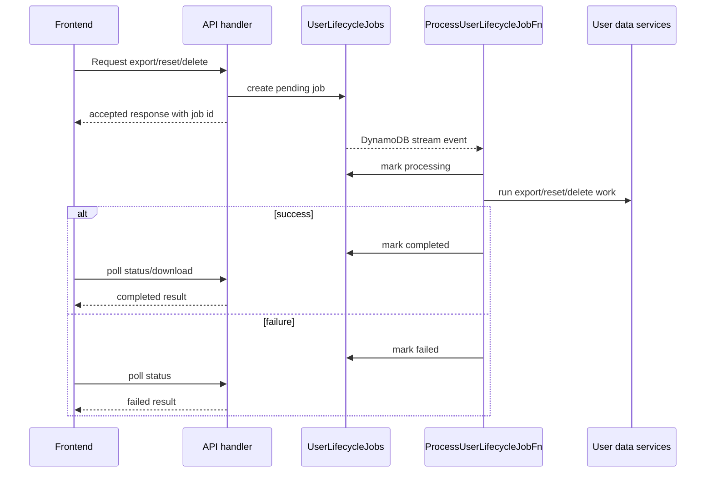

# User Lifecycle Job Flow

Use this diagram for heavy or destructive operations such as export, reset, and account deletion.

## ASCII

```text
Frontend request
  -> API creates a pending lifecycle job
  -> API returns quickly with job id
  -> DynamoDB stream emits new job record
  -> worker Lambda marks processing
  -> worker executes export / reset / delete work
  -> worker marks completed or failed
  -> frontend polls job status
  -> frontend downloads export or finalizes auth cleanup if needed
```

## Mermaid



## Local Dev Note

In LocalStack-style development, the repo uses an in-process dispatcher instead of waiting for the DynamoDB stream path. The state model stays the same, but the trigger mechanism is simplified for local work.
