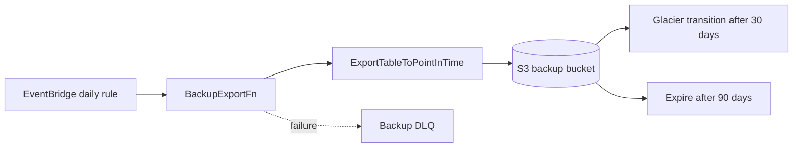

# Scheduled Backup Export

This diagram is for disaster-recovery plumbing and scheduled asynchronous work.

## ASCII

```text
EventBridge daily rule
  -> BackupExportFn
  -> DynamoDB ExportTableToPointInTime for selected tables
  -> S3 backup bucket
  -> Glacier transition after 30 days
  -> expiration after 90 days
  -> failures land in Backup DLQ
```

## Mermaid



## Why It Exists

- the export path is operational, not user-driven
- DynamoDB point-in-time export avoids scanning tables through the live API
- the DLQ gives an operational signal when scheduled protection fails
