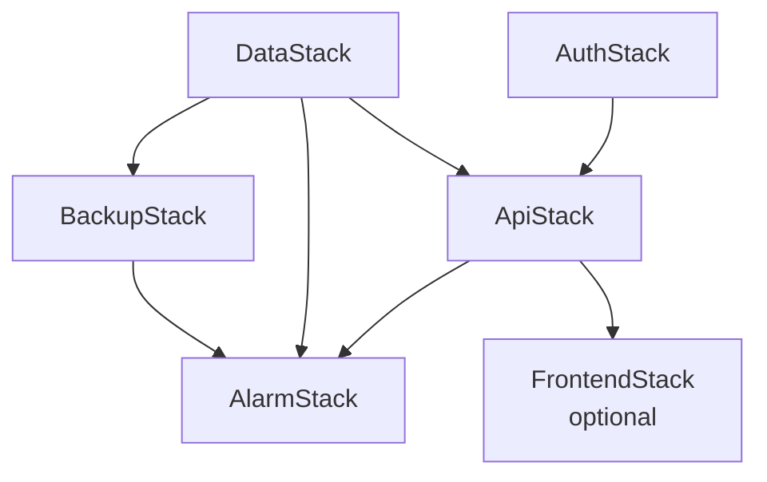

# Stack Dependencies

Use this diagram when discussing deployment order, blast radius, and why the infra is split into multiple CDK stacks.

## ASCII

```text
┌─────────────┐     ┌─────────────┐
│  DataStack  │     │  AuthStack  │
└──────┬──────┘     └──────┬──────┘
       │                   │
       │         ┌─────────┘
       │         │
       ▼         ▼
┌─────────────────────────┐
│        ApiStack         │◄──────┐
└────────────┬────────────┘       │
             │                     │
     ┌───────┴───────┐             │
     │               │             │
     ▼               ▼             │
┌──────────┐   ┌──────────────┐    │
│ Frontend │   │  AlarmStack  │◄───┤
│(optional)│   └──────┬───────┘    │
└──────────┘          │            │
                      │            │
            ┌─────────┘            │
            │                      │
            ▼                      │
┌──────────────────┐               │
│   BackupStack    │───────────────┘
└──────────────────┘

Deployment order: Data/Auth → Api → Frontend
                   Data → Backup → Alarm
                   Api  → Alarm
```

## Mermaid



## Read This As

- data and auth are foundational stacks
- the API stack depends on both because it needs table names and Cognito config
- the alarm stack depends on backup, API, and data because it watches those resources directly
- the frontend stack is optional because production can use GitHub Pages instead
- when `FrontendStack` is used, it is deployed after `ApiStack` so the frontend hosting path stays aligned with the published API environment
