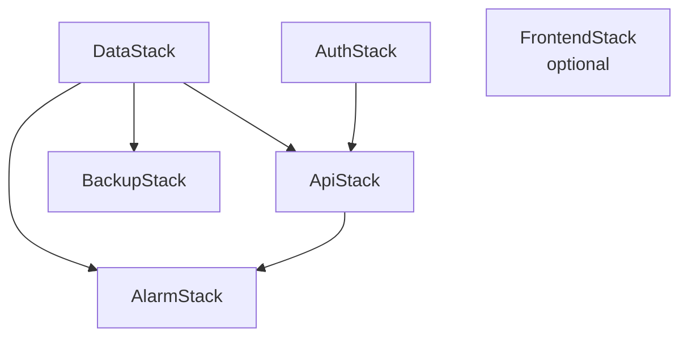

# Stack Dependencies

Use this diagram when discussing deployment order, blast radius, and why the infra is split into multiple CDK stacks.

## ASCII

```text
DataStack ----+
              +--> ApiStack ----+
AuthStack ----+                 |
                                +--> AlarmStack
DataStack ----------------------+
DataStack -----------------------> BackupStack

FrontendStack is separate and optional for S3 + CloudFront hosting.
```

## Mermaid



## Read This As

- data and auth are foundational stacks
- the API stack depends on both because it needs table names and Cognito config
- backup and alarms are separate so operational concerns can evolve without repackaging the whole app
- the frontend stack is optional because production can use GitHub Pages instead
